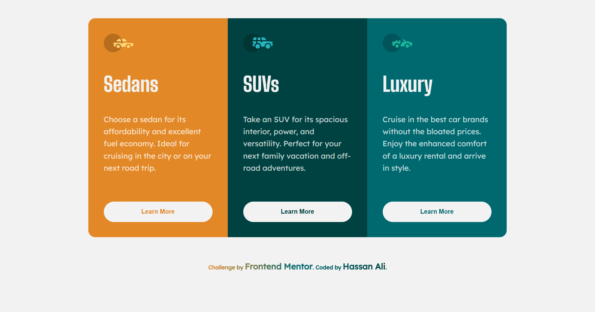
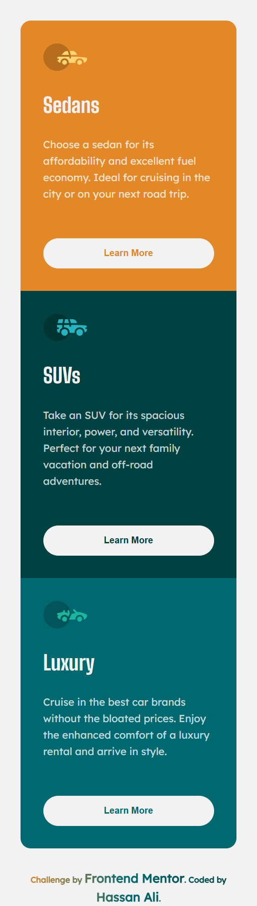
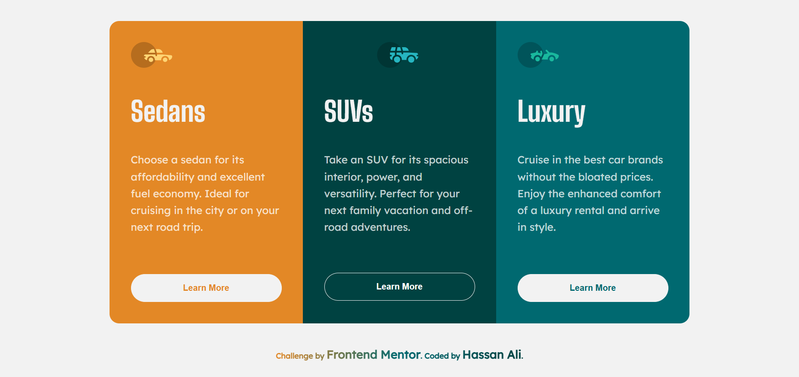

# Frontend Mentor - 3 Column Preview Card Component Solution

This is my solution to the [3 Column Preview Card Component](https://www.frontendmentor.io/challenges/3column-preview-card-component-pH92eAR2-) challenge on Frontend Mentor.  
Frontend Mentor challenges help you practice building realistic, production-ready layouts.

---

## 📌 Overview

### 🔹 The Challenge

Users should be able to:

- View the **3 cards** stacked vertically on mobile and aligned horizontally on desktop.
- Experience a clean, semantic, and accessible design.
- See smooth hover and focus states for interactive elements.
- Notice micro-interactions like the logo moving when the button is hovered/focused.

---

## 🖼️ Screenshots

### Desktop



### Mobile



### Active-State


---

## 🌐 Live Demo

👉 [View Live Demo](https://hassan-ali-byte.github.io/3-column-preview-card-component/)

---

## ⚙️ My Process

### Built With

- ✅ Semantic **HTML5 markup** (`<main>`, `<section>`, `<article>`)
- 🎨 **CSS custom properties** for colors, typography, and spacing
- 📐 **Responsive units** (`clamp`, `em`, `rem`) for scalable design
- ⚡ **CSS Grid** for the card container layout
- 🎬 **CSS transitions** with `transform` and `cubic-bezier` easing for smooth animations
- 🧩 **`:has()` selector** for parent–child state interactions
- 📱 **Mobile-first workflow**

---

## 📚 What I Learned

This project taught me several valuable concepts:

1. **Responsive Layout Decisions**

   - I evaluated both **Flexbox** and **Grid**.
   - With Flexbox, handling mid-screen layouts required nesting and extra logic.
   - With Grid, I could directly span columns/rows, making the design much easier and cleaner.

2. **Accessibility**

   - Buttons support both `:hover` and `:focus-visible`, making them keyboard-friendly.

3. **Modern CSS with `:has()`**

   - Connected button states to animate the logo inside the same card:

     ```css
     .card:has(.card-btn:hover) .card-logo,
     .card:has(.card-btn:focus-visible) .card-logo {
       transform: translateX(35%);
     }
     ```

   - This selector allows **styling a parent based on a child’s state**, something impossible before without JavaScript.

4. **Micro-Interactions**
   - Used `cubic-bezier(0.68, -0.55, 0.27, 1.55)` easing for a **bounce effect** on the logo.
   - Buttons animate slightly upwards on hover/focus for a polished experience.

---

## 🔗 Resources

- [Josh Comeau – CSS Transitions & Beziers](https://www.joshwcomeau.com/animation/css-transitions/)
- [MDN – `:has()` Selector](https://developer.mozilla.org/en-US/docs/Web/CSS/:has)

## 🔗 Resources

- [Josh Comeau – CSS Reset](https://www.joshwcomeau.com)
- [Kevin Powell ](https://www.youtube.com/@KevinPowell)

---

## 👨‍💻 Author

**Hassan Ali**

- Frontend Mentor – [@hassan-ali-byte](https://www.frontendmentor.io/profile/hassan-ali-byte)
- GitHub – [hassan-ali-byte](https://github.com/hassan-ali-byte)

---

✨ Thanks for checking out my solution!  
Feedback and suggestions are always welcome 🙌
